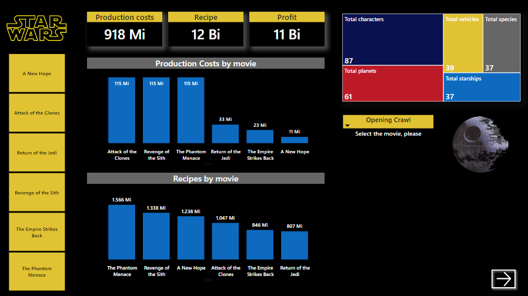
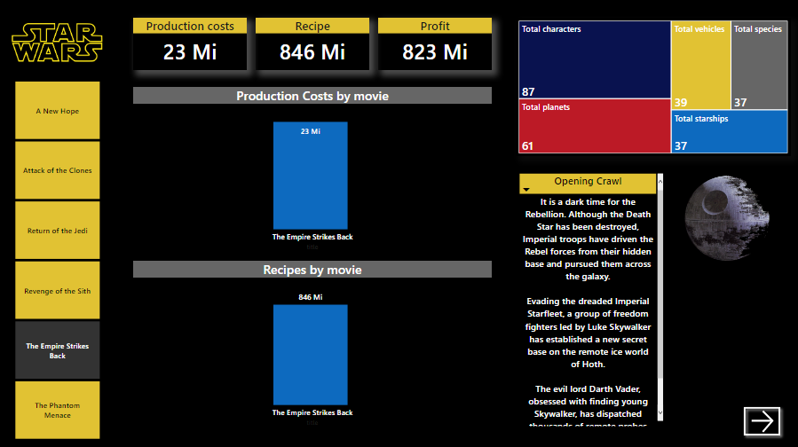
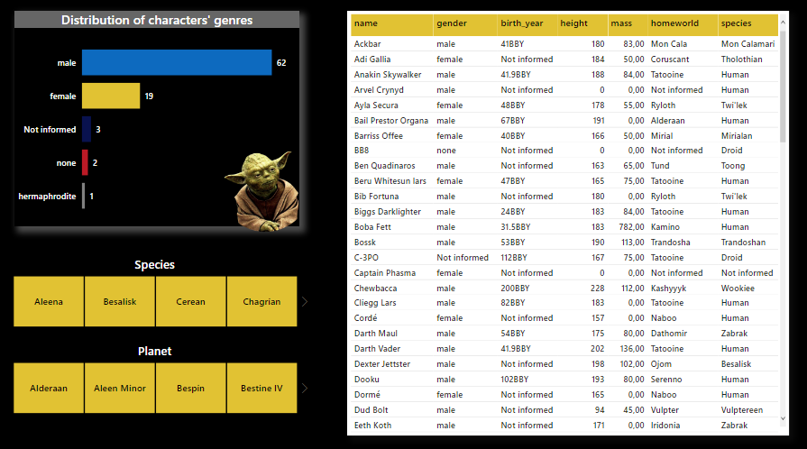
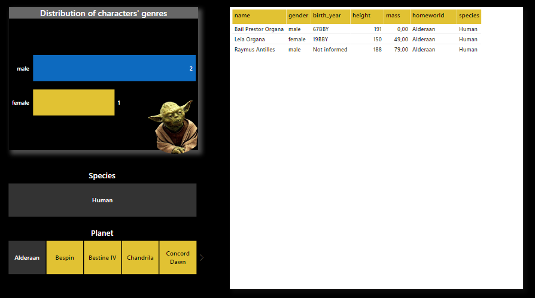

# Star Wars Universe Dashboard
To build the dashboard I used three diferent sources: a Star Wars API, a dataset provided by Kaggle and a table from The Number website. You can find this resources at the following link:
- Star Wars API: https://swapi.dev/about
- Dataset in Kaggle: https://www.kaggle.com/jsphyg/star-wars/code
- The Numbers: https://www.the-numbers.com/movies/franchise/Star-Wars#tab=summary

This is the first page of the dashboard. In it we can see the total cost of production, recipes and profit by movie. We can also see 
the total of characters, species, planets, vehicles and starships. 

 
  
This second image shows us an example of when we select a movie and we can see the measurements changing and also the prologue of the film.

 
 
And when we click the arrow we go to the second page of the dashboard that show us the distribution of characters' genres and a table with some informations about the characters.

 
 
 Also has the option to select by specie or planet, this is a example of when we select the humans from Alderaan. 
 
 
 
